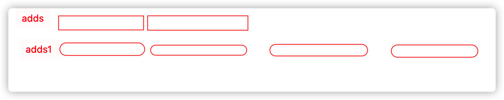
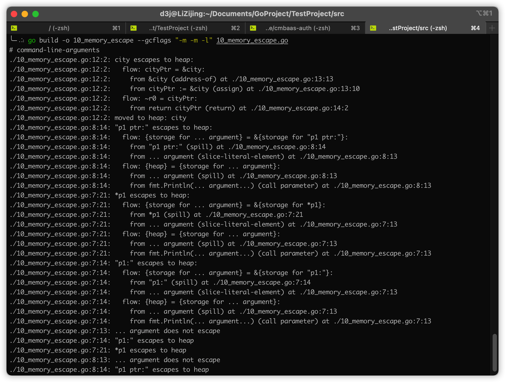
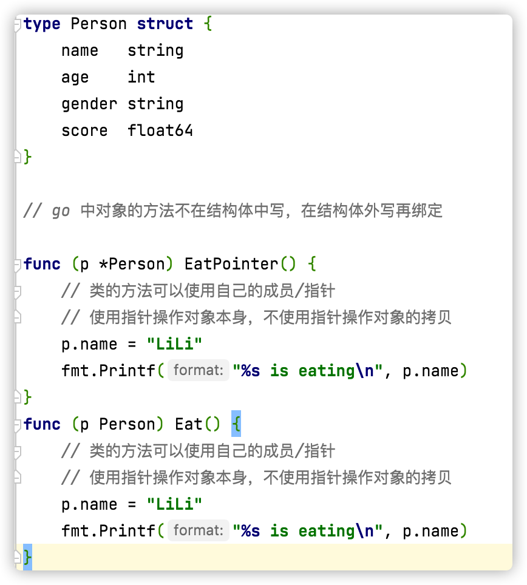

# Golang 学习笔记

## 一、前注

go 官方网站：[The Go Programming Language (google.cn)](https://golang.google.cn/)

go 官方文档：[Documentation - The Go Programming Language (google.cn)](https://golang.google.cn/doc/)

go 语言 SDK：[Downloads - The Go Programming Language (google.cn)](https://golang.google.cn/dl/)，或者 `brew install go`

IDE:Goland 或者 VSCode

## 二、概述

==go 语言对程序格式要求非常高==

### 1.工程概述

go 语言项目需要有特定的目录解构进行管理，一个标准的 go 工程起码有三个目录：

- src
  - 放源代码文件
- bin
  - 放编译后的程序：`go install`
- pkg
  - 放依赖包

### 2.GO 环境变量

go SDK 的安装位置：`GOROOT`

工程位置环境变量：`GOPATH`

目标机器的操作系统，在 `go build` 时会用到：`GOOS`

目标机器的处理器架构：`GOARCH` ，可以是 386、amd64、arm

### 3.GO 基本语句

```
go build //编译自身包和依赖包
go install //编译并安装自身包和依赖包
gofmt //格式化代码
go doc //生成代码文档
```

## 三、GO 基本语法

### 1.文件名、关键字和标识符

**文件名**

Go 的源文件以 `.go` 为后缀名存储，文件名均有小写字母组成，允许使用下划线，不包含空格或其他特殊字符，且必须以小写字母开头，eg：`test_1.go`

**关键字**

|  **break**   |   **default**   |  **func**  | **interface** | **select** |
| :----------: | :-------------: | :--------: | :-----------: | :--------: |
|   **case**   |    **defer**    |   **go**   |    **map**    | **struct** |
|   **chan**   |    **else**     |  **goto**  |  **package**  | **switch** |
|  **const**   | **fallthrough** |   **if**   |   **range**   |  **type**  |
| **continue** |     **for**     | **import** |  **return**   |  **var**   |

**标识符**

| **append** |  **bool**   |  **byte**   |   **cap**   | **close**  | **complex** | **complex64** | **complex128** | **uint16**  |
| :--------: | :---------: | :---------: | :---------: | :--------: | :---------: | :-----------: | :------------: | :---------: |
|  **copy**  |  **false**  | **float32** | **float64** |  **imag**  |   **int**   |   **int8**    |   **int16**    | **uint32**  |
| **int32**  |  **int64**  |  **iota**   |   **len**   |  **make**  |   **new**   |    **nil**    |   **panic**    | **uint64**  |
| **print**  | **println** |  **real**   | **recover** | **string** |  **true**   |   **uint**    |   **uint8**    | **uintptr** |

### 2.GO 不支持的语法

1. 不支持前置自增自减：++i、--i
2. 不支持地址加减
3. 不支持三目运算(?:)
4. 只有 true/false 才能代表逻辑真/假，0 和 nil 不行

### 3.slice 的容量与长度



go 为了保障效率直接分配多一倍的容量，但长度还是实际的使用长度，在容量为达到当前上限前不会再分配，直至达到上限

[深入理解 Go Slice - SegmentFault 思否](https://segmentfault.com/a/1190000017341615)

### 4.字典 map

哈希表(key<==>value)，key 是经过哈希运算的

### 5.内存逃逸



```shell
go build -o 10_memory_escape --gcflags "-m -m -l" 10_memory_escape.go > output 2>&output
```

### 6.iota 常量组累加器

1. iota 是常量组计数器
2. iota 从 0 开始，每换行递增加1
3. 常量组有个特点，如果不赋值，默认与上一行表达式相同
4. 如果同一行出现两个 iota 则这两个 iota 值相同
5. 每个常量组的 iota 是独立的，iota 遇到新的 const 会重置为 0

### 7.init 函数

1. C 语言中没有 init 函数，一般自己写 init 函数再构造函数中调用
2. go 语言中再带 init 函数，每一个包中可以包含一个或多个 init 函数
3. 这个 init 函数再包被引用的时候（import）进行自动调用，不允许显式调用
4. 有时引用一个包时只想引用包中的 init 函数（eg：MySQL 的 init 对驱动进行初始化），为了避免编译器报错可以使用 '_' 避免报错：`import _ "xxx/xxx"`

[【Go语言学习】包、Init函数与执行顺序_Eric_zhang929的博客-CSDN博客](https://blog.csdn.net/Eric_zhang929/article/details/102550955)

### 8.defer 延迟

1. 关键字：defer 可以用于修饰语句、函数，确保这条语句可以在当前栈退出的时候执行

    ```c
    lock.Lock()
    a = "hello"
    lock.Unlock()//<==经常容易忘掉解锁
    ```

    go 语言中

    ```go
    {
        lock.Lock()
        defer lock.Unlock()//<==在当前栈退出的时候（例如：函数结束时）执行
        a = "hello"
    }
    
    /*例如在文件读写时*/
    {
        file1,_ := file.Open()
        defer file1.Close()
    }
    ```

2. 一般用于做资源清理工作

3. 解锁、关闭文件

4. 在同一个函数中可以多次调用 defer，类似于栈的机制：先入后出

## 四、面向对象操作

### 1.类封装

go 语言支持类的操作，但是没有 class 关键字，使用 struct 来模拟类

### 2.绑定方法

go 中类的方法不在结构体中写，在结构体外写再绑定

```go
func (变量名 类名/类指针) 方法名(参数)返回值{}
```



### 3.继承

==golang 中并不存在真正的继承，只是 struct 之间的组合==

### 4.多态

C++：使用纯虚函数替代接口，实现多态

go：使用接口（interface）实现多态

interface 不仅仅是用于处理多态，可以接受任意数据类型，有点类似 void
